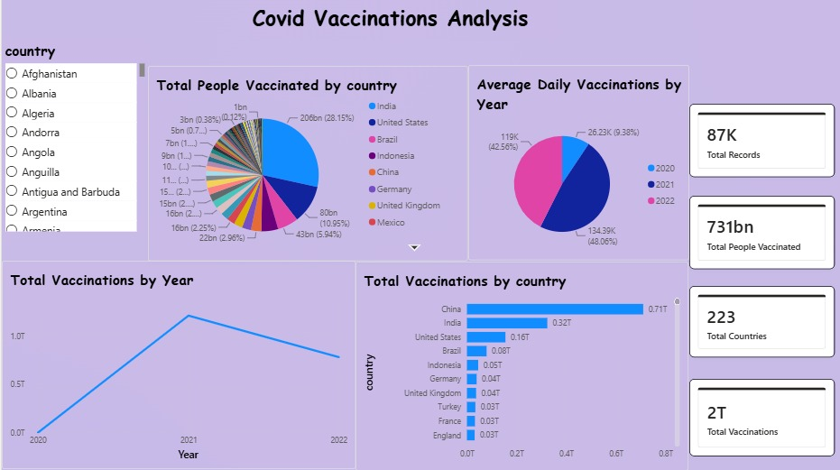

# 📊 COVID Vaccination Analysis

## 🔷 Project Overview

COVID Vaccination Analysis was performed using **Excel, SQL, and Power BI**.

---

## 📊 Dataset

**Source:**
https://www.kaggle.com/datasets/gpreda/covid-world-vaccination-progress

---

## 🛠 Tools & Technologies Used

* Microsoft Excel
* SQL Server
* Power BI

---

## 🔍 SQL Analysis Highlights

Key queries performed in **covid_analysis.sql**:

* Total record count — verifying dataset size
* Top 10 countries by Total Vaccinations — ranking countries by doses administered
* Top 10 countries by People Vaccinated — tracking at-least-one-dose coverage
* India's vaccination timeline — date-wise trend for India specifically
* Schema exploration — INFORMATION_SCHEMA.TABLES for database structure

---

## 📊 Power BI Dashboard

An interactive dashboard was created with the following features:

* Pie Chart — Total People Vaccinated by Country
* Country-wise Filters — Slicer for selecting specific countries
* DAX Measures — Custom calculations
* Trend Analysis — Vaccination progress over time
* Comparison Visuals — Fully vaccinated vs partially vaccinated

### DAX Measure Example

```DAX
Total People Vaccinated =
SUM('country_vaccinations_Cleaned'[people_vaccinated])
```

---

## 📷 Dashboard Preview

### Dashboard  - Covid Vaccination Analysis



---

## 🌍 Key Insights

* India & United States lead in total vaccinations administered globally
* Indonesia & Brazil follow closely in total dose counts
* Multiple vaccine brands (Pfizer, AstraZeneca, Johnson & Johnson, etc.) are tracked per country
* Daily vaccination rates show clear acceleration patterns post mid-2021

---

## 📌 Project Highlights

* Raw data cleaned and preprocessed before analysis
* SQL used for data validation and exploration
* Power BI dashboard built with DAX measures
* Country-level and global-level insights presented

---

## 📁 Project Structure
```
├── Dashboard/
        ├── Page1.jpeg

├── country_vaccinations_Cleaned.csv

├── covid_analysis.sql

├── Project 3.pbix

└── README.md
```
